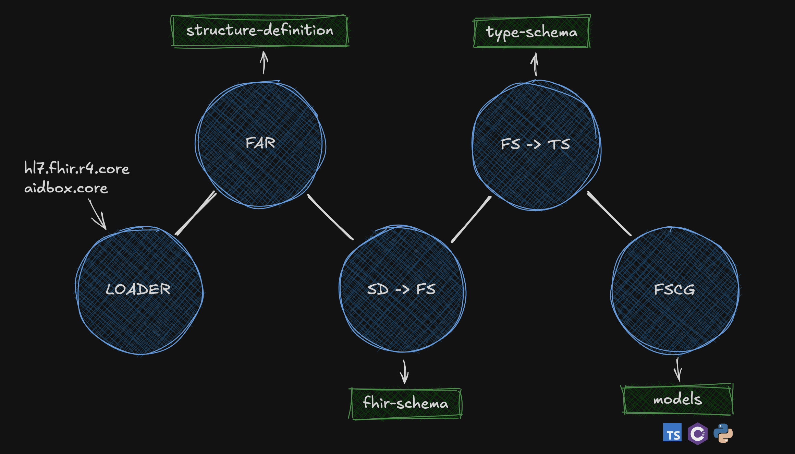

# FHIR Type Schema

[](https://github.com/fhir-clj/type-schema/actions/workflows/ci.yaml)

Status: **Draft**

This repository contains the Clojure library to generate the Type Schema, an intermediate representation for FHIR SDK generation.

Recommended file extension for the FHIR Type Schema is `.ts.json`.

<!-- markdown-toc start - Don't edit this section. Run M-x markdown-toc-refresh-toc -->
**Table of Contents**

- [FHIR Type Schema](#fhir-type-schema)
  - [Motivation](#motivation)
  - [Overview](#overview)
    - [Common Structure](#common-structure)
    - [`"primitive-type"`](#primitive-type)
    - [`"resource"`, `"complex-type"`](#resource-complex-type)
    - [`"nested"`](#nested)
    - [Snippet of the Patient resource from hl7.fhir.r4.core](#snippet-of-the-patient-resource-from-hl7fhirr4core)
    - [Validation by JSON Schema](#validation-by-json-schema)
  - [SDK Pipeline](#sdk-pipeline)
  - [TODO](#todo)
  - [Installation & Usages](#installation--usages)
    - [Command Line Usage](#command-line-usage)
      - [Using Clojure directly](#using-clojure-directly)
      - [Build & Use the JAR file](#build--use-the-jar-file)
      - [Using the downloaded native binary](#using-the-downloaded-native-binary)
      - [Examples](#examples)

<!-- markdown-toc end -->

## Motivation

Long story short:

- Custom FHIR SDK is better than a universal one
- Type Schema makes it simple.

For the long story, take a look at: [Type Schema: a Pragmatic Approach to Build FHIR SDK](https://www.health-samurai.io/articles/type-schema-a-pragmatic-approach-to-build-fhir-sdk)

## Overview

The Type Schema is a JSON-based format that provides a simplified representation of FHIR entities (resources, primitive types, etc.).

JSON Schema to validate the FHIR Type Schemas is placed in <docs/type-schema.schema.json>.

Examples of Type Schema and related FHIR Schema are placed in <docs/examples>.

### Common Structure

All FHIR Type Schema entities share a common structure with an `identifier` field which is an ID if defined in the root, or reference if used in other ways:

- `kind`: The type of entity, which can be:
  - `"primitive-type"`: Primitive types like string, boolean, decimal
  - `"resource"`: FHIR resources like Patient, Observation
  - `"complex-type"`: Complex data types like HumanName, Address
  - `"nested"`: Backbone elements within resources
- `package`: The FHIR package source (e.g., "hl7.fhir.r4.core")
- `version`: The version of the FHIR package (e.g., "4.0.1")
- `name`: The name of the type (e.g., "Patient", "string")
- `url`: The canonical URL of the type (e.g., "http://hl7.org/fhir/StructureDefinition/Patient")

Other fields are specific to the kind.

### `"primitive-type"`

Primitive types are simpler with:

- `identifier`: As described above
- `description`: Human-readable description of the entity
- `base`: Reference to the base type in accordance to Structure Definition
- `dependencies`: References to all mentioned FHIR entities

### `"resource"`, `"complex-type"`

Resources and complex types include:

- `identifier`: As described above
- `description`: Human-readable description of the entity
- `base`: Reference to the base type in accordance to Structure Definition
- `fields`: Object mapping field names to their definitions, including:
  - `type`: Reference to another type
  - `reference`: Reference to another type
  - `array`: Boolean indicating if the field can have multiple values
  - `required`: Boolean indicating if the field is required
  - `enum`: List of possible values for the primitive type if we can simply expand value set for it
  - `choices`: For choice[x] elements, lists possible type options
  - `choiceOf`: Name of the choice type
- `nested`: Array of nested backbone element type definitions
- `dependencies`: References to all mentioned FHIR entities

For details on special cases like choice types, see [./docs](./docs).

### `"nested"`

Backbone elements are represented as:

- `identifier`: As described above with kind="nested"
- `base`: Reference to the base type in accordance to Structure Definition. Usually references BackboneElement type
- `fields`: Object mapping field names to their definitions, see above
- `dependencies`: References to all mentioned FHIR entities

This normalized structure eliminates the complexity of navigating differential and snapshot views in Structure Definitions, making it straightforward to generate strongly-typed code in any programming language.

### Snippet of the Patient resource from hl7.fhir.r4.core
You can see the full type-schema structure in [./test/golden/patient.ts.json](./test/golden/patient.ts.json), which demonstrates how a Patient resource is represented in our normalized format.

This structure makes it easy to understand the relationships between FHIR resources and their properties during generation process without having to parse and lookup for the more complex original FHIR definitions.

```json
{
  "identifier" : {
    "kind" : "resource",
    "package" : "hl7.fhir.core.r4",
    "version" : "4.0.1",
    "name" : "Patient",
    "url" : "http://hl7.org/fhir/StructureDefinition/Patient"
  },
  "base" : {
    "kind" : "resource",
    "package" : "hl7.fhir.r4.core",
    "version" : "4.0.1",
    "name" : "DomainResource",
    "url" : "http://hl7.org/fhir/StructureDefinition/DomainResource"
  },
  "description" : "Demographics and other administrative information about an individual or animal receiving care or other health-related services.",
  "fields" : {
    "address" : {
      "array" : true,
      "required" : false,
      "excluded" : false,
      "type" : {
        "kind" : "complex-type",
        "package" : "hl7.fhir.r4.core",
        "version" : "4.0.1",
        "name" : "Address",
        "url" : "http://hl7.org/fhir/StructureDefinition/Address"
      }
    },
    "managingOrganization" : {
      "array" : false,
      "required" : false,
      "excluded" : false,
      "type" : {
        "kind" : "complex-type",
        "package" : "hl7.fhir.r4.core",
        "version" : "4.0.1",
        "name" : "Reference",
        "url" : "http://hl7.org/fhir/StructureDefinition/Reference"
      },
      "reference" : [ {
        "kind" : "resource",
        "package" : "hl7.fhir.r4.core",
        "version" : "4.0.1",
        "name" : "Organization",
        "url" : "http://hl7.org/fhir/StructureDefinition/Organization"
      } ]
    },
    ...
  },
  "nested": [...],
  "dependencies" : [ {
    "kind" : "resource",
    "package" : "hl7.fhir.r4.core",
    "version" : "4.0.1",
    "name" : "DomainResource",
    "url" : "http://hl7.org/fhir/StructureDefinition/DomainResource"
  },
  ...
  ]
}
```

### Validation by JSON Schema

JSON Schema for the FHIR Type Schema is placed in <docs/type-schema.schema.json>.

How to check JSON by this schema:

```shell
$ npm install -g ajv-cli
$ ajv test -s docs/type-schema.schema.json -d docs/example.ts.json --valid
$ find . -name "*.ts.json" | xargs -n 1 ajv test -s docs/type-schema.schema.json --valid -d
```

## SDK Pipeline



The typical SDK generation pipeline with Type Schema consists of several transformation steps:

1. **FHIR Package Loader** [Github](https://github.com/fhir-clj/fhir-package-registry) → Start with a FHIR package (e.g., `hl7.fhir.r4.core@4.0.1`)
   - Contains Structure Definitions, Value Sets, and other FHIR artifacts and Aidbox configuration packages with Custom Resource, Acess Policy, User etc.
   - Provides the canonical definitions for FHIR resources and types

2. **FHIR Artifact Regestry** : TBD

3. **FHIR Schema Generation** [Github](https://github.com/fhir-clj/fhir-schema)
   - Transform Structure Definitions into FHIR Schema
   - Simplifies the complex differential/snapshot structure
   - Normalizes resource and type definitions
   - Recommended extension: `.fs.json`

4. **Type Schema Generation** [Github](https://github.com/fhir-clj/type-schema)
   - Transform FHIR Schema into Type Schema
   - Further simplifies and normalizes for code generation
   - Makes the structure more language-agnostic
   - Recommended extension: `.ts.json`

5. **SDK Generation** (language-specific part)
   - Consume Type Schema to generate language-specific code
   - Generate classes, types, or structs for each resource
   - Add validation, serialization, and deserialization capabilities
   - Implement FHIR operations as language-specific methods
   - Output is ready-to-use SDK code in target language

See the example of the last step implemented in TypeScript for several languages here: [fhir-schema-codegen](https://github.com/fhir-schema/fhir-schema-codegen)

This pipeline separates concerns between parsing FHIR packages, transforming into intermediate representations, and generating language-specific code, making each step more maintainable and reusable.

## TODO

- [ ] ndjson/path output from CLI
- [ ] Bindings
- [ ] Extension
- [ ] Docstrings
- [ ] Profiles
- [ ] Search Parameters
- [ ] Operations

## Installation & Usages

You can download the latest release jar from the [GitHub Releases page](https://github.com/fhir-clj/type-schema/releases). Or native standalone binaries that don't require a Java runtime. Simply download the appropriate binary for your operating system and architecture.

### Command Line Usage

```console
$ ./type-schema --help
Type Schema Generator for FHIR packages

Usage: program [options] <package-name>

Options:
  -o, --output DIR     Output directory or .ndjson file
      --separated-files Output each type schema to a separate file (requires -o to be set to a directory)
      --treeshake TYPES List of required types to include in output (comma-separated); output will only include these types and their dependencies
  -v, --verbose        Enable verbose output
      --version        Print version information and exit
  -h, --help           Show this help message

Examples:
  program hl7.fhir.r4.core@4.0.1                              # Output to stdout
  program -v hl7.fhir.r4.core@4.0.1                           # Verbose mode
  program -o output hl7.fhir.r4.core@4.0.1                    # Output to directory
  program -o result.ndjson hl7.fhir.r4.core@4.0.1             # Output to file
  program -o output --separated-files hl7.fhir.r4.core@4.0.1  # Output each type schema to a separate file
  program --treeshake Patient,Observation hl7.fhir.r4.core@4.0.1  # Only include specified types and dependencies
  program --version                                           # Show version
```

#### Using Clojure directly

```console
$ clj -M -m main --version
type-schema version 0.0.8
```

#### Build & Use the JAR file

```console
$ make build
target/type-schema.jar
$ java -jar target/type-schema.jar --version
type-schema version 0.0.8
```

#### Using the downloaded native binary

```console
$ ./type-schema --version
type-schema version 0.0.8
```

#### Examples

- Generate Type Schemas for hl7.fhir.r4.core to ndjson file:

    ```console
    $ clj -M -m main hl7.fhir.r4.core@4.0.1 -o ./fhir.r4.ndjson
    ```

- Generate Type Schemas for Patient resource from hl7.fhir.r4.core and its dependencies:

    ```console
    $ clj -M -m main hl7.fhir.r4.core@4.0.1 --treeshake Patient -o output --separated-files
    ```
